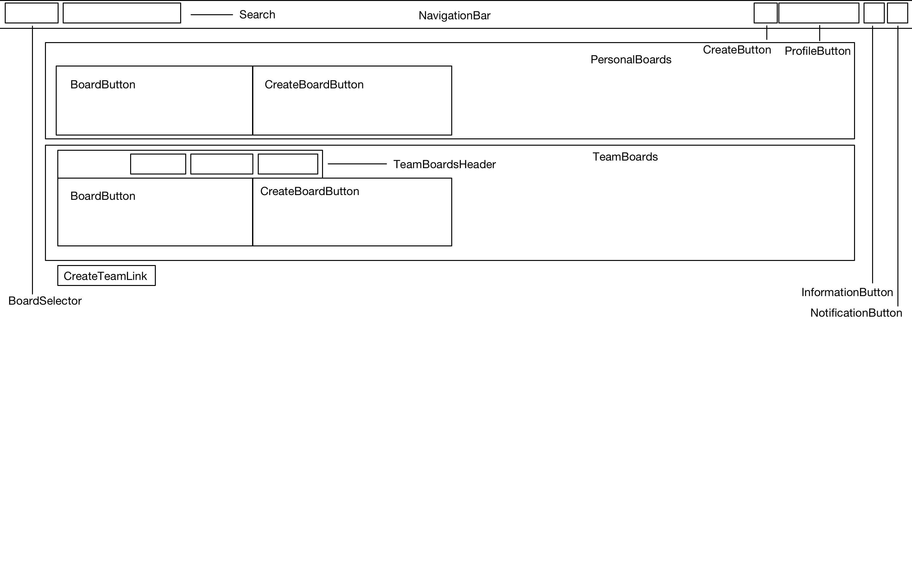
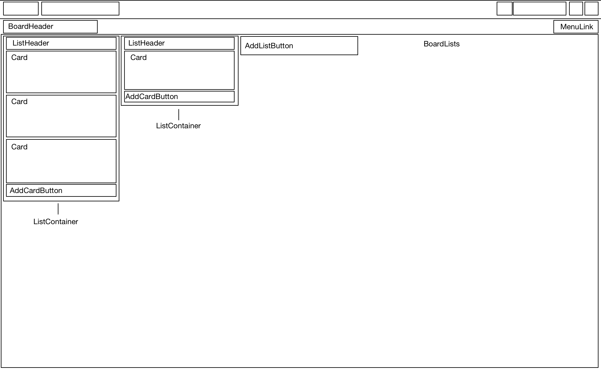
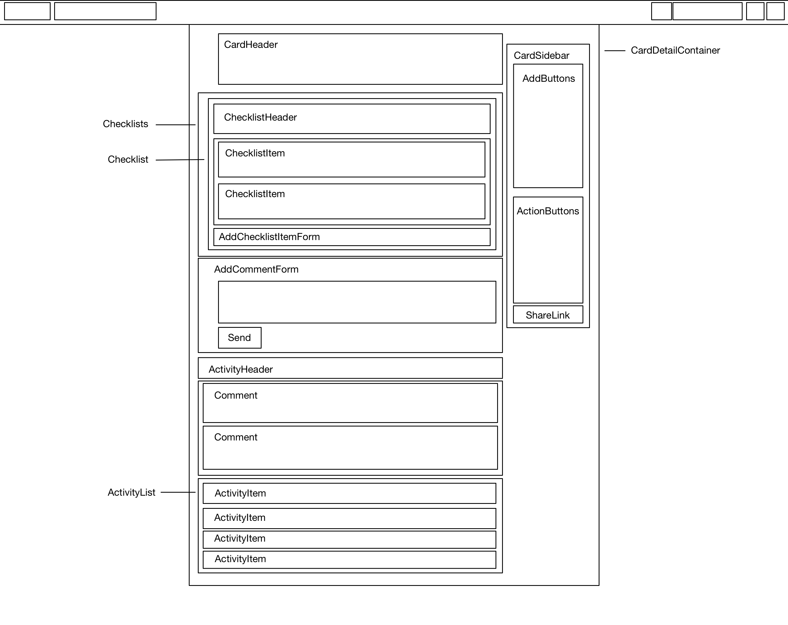

# Collaboardate

[Collaboardate Live](https://collaboardate.com)

Collaboardate is a full stack web application inspired by Trello.  It utilizes a [Ruby on Rails](http://rubyonrails.org/) backend and [PostgreSQL](https://www.postgresql.org/) database to provide a RESTful JSON API for a the front end [React](https://facebook.github.io/react/) application.  Front end state is stored and managed using a [Redux](https://github.com/reactjs/redux) state container. Drag and drop reordering is implemented using [React DnD](https://gaearon.github.io/react-dnd/), and [Moment.js](http://momentjs.com/) provides date handling features.

## Features and Implementation

### Boards

Boards are containers for objects and lists.  The `boards` table includes the following columns:

- `id`: The primary key.
- `title`: The title of the board.
- `visibility`: A board can be public (visible to anyone) or private (only accessible by other users you have shared the board with).
- `background`: Specifies the background color for the board.  Currently the following colors are available: blue, orange, green, red, purple, pink, light green, light blue, and grey.
- `creator_id`: Foreign key link to the User who created the board (and can manage board permissions).

When a user logs in, their boards requested and loaded into the Redux store (under the `boards` portion of the state tree).  This includes both boards they have created and boards that have been shared with them by other users (more on board sharing later).  Boards are displayed as tiles on the boards index page.  Their title is displayed, and the tile is colored with the chosen background color.

When opening a board, the corresponding lists and cards are requested and loaded into the Redux store (under the `lists` and `cards` portions of the state tree, respectively).  Once loaded, lists are displayed in order across the board page, and cards are displayed in order vertically within their respective lists.

### Lists and Cards

Lists are stored in the `lists` table:

- `id`: The primary key.
- `title`: The title of the list.
- `ord`: A zero-based order column indicating the ordering of the list within its associated board.
- `board_id`: A foreign key associating the list with a board.

Cards are stored in the `cards` table:

- `id`: The primary key.
- `title`: The title of the card.
- `description`: An optional longer card description.
- `due_date`: A date/time field indicating a due date for the task that the card represents.
- `due_date_complete`: A boolean field indicating whether the task that the card represents has been completed.  This field is only used if a due date has been set.
- `ord`: A zero-based order column indicating the ordering of the card within its associated list.
- `list_id`: A foreign key associating the card with a board.
- `author_id`: A foreign key linking the card to the user who created it.

### Drag and Drop Reordering

One of Trello's core features is the ability to reorder lists and cards by dragging and dropping the cards into a new position.  Lists can be reordered by clicking and dragging the list container, and Cards can be reordered by clicking and dragging the card itself.  I used [React DnD](https://gaearon.github.io/react-dnd/) to implement this feature.  After experimenting with several approaches, I implemented the following:

1. When an item (list or card) is dragged, a CSS class is applied to the component which darkens the background and hides the elements within it.  This gives the appearance of an empty space where the item can be dropped.
2. When the item is dragged over another component of the same type, a Redux action is fired to update the local state.  This immediately updates the positioning of the item on the front end, reordering the surrounding cards and creating a space for the dragged item in its new position.
3. When the item is dropped, an AJAX action thunk is fired.  This updates the ordering of cards on the back end.  When the AJAX response is received, the updated item details are sent to the Redux store via another action dispatch.  This ensures that the backend and front end representations of the items remain in sync.

### Board Sharing

Collaboardate includes the ability to share a board with another user.  This allows the user to edit and update the contents of the board.  Once shared, the board will appear on the other user's boards index under a "Shared Boards" heading.  The Rails controller automatically combines the user's personal boards and shared boards in the BoardsController's index action.  On the front end, selectors are used to separate boards into Personal Boards and Shared Boards based on the creator_id of the board.

A basic user search feature was implemented to allow users to search for and select a user to share a board with. A UsersController search action returns a list of users matching the search query string.  These users are displayed with their current share state.  A button is rendered to either remove or add the user to the board, based on their current state. Users with access to a board are stored under a `users` key within an individual board's state.  

A basic join table linking the sharing user, the board, and the user receiving the share is used to implement this feature.  The corresponding thunk actions and AJAX requests create and destroy these objects, and upon response, update the local state.

### Comments

Comments are stored in the `comments` table:

- `id`: The primary key.
- `body`: The comment body.
- `card_id`: The card the comment is associated with.
- `author_id`: The user who authored the comment.

Comments are loaded when a user opens the detail view of a specific card:

Clicking on a card on the board page requests the show URL for that card.  This triggers and AJAX request to load the card details into the `cardDetail` portion of the Redux state.  Nested within the card details is a `comments` collection.  A selector is used to order comments in reverse chronological order, for rendering.

### Due Dates

Due dates are represented by two fields on the `cards` table, `due_date` and `due_date_complete`.  Due dates are displayed on both the board page and card detail page. [Moment.js](http://momentjs.com/) is used determine the the relation of the due date to the current date.  Coloring styles are applied based on the status of the due date and due date completion: completed, upcoming (within two days), immediate (within 4 hours before or 8 hours after), or recent (more than 8 hours past).

## Future Directions

In the coming weeks, I plan to work on the following features:

### Checklists

Allow creation of checklists which represent subtasks within an individual card.  `checklists` and `checklist_items` tables will be created to represent lists and individual items, respectively.  Checklist state will be nested under the `cardDetail` portion of the Redux state.

### Labels

Allow assignment of one or more labels to each card.  Labels are unique to each board, so a `labels` table will be created to describe labels and link them to a board.  a `card_labels` table will be used to link them to a specific card.  Labels will be nested under the portion of the state representing the associated board, with associations to those labels nested under the individual cards.  Color tags representing the card labels will appear on cards on the board page, so these details will be nested under both the `cards` property under the `boards` portion of the state, and under the `cardDetail` portion of the state.

### Card Assignment

Allow users to be assigned to a particular card (for example, if they are expected to complete the associated task).  This would be a join table between `cards` and `users`, and represented in the state as an `assigned_users` property nested under the `cardDetail` portion of the Redux state.

### Notifications

Implement notifications and live updating, so that users can see updates performed by other users immediately (without refreshing) and receive notifications if cards they are assigned to are updated.

### Card Search

Implement search feature which searches cards and possibly boards.
